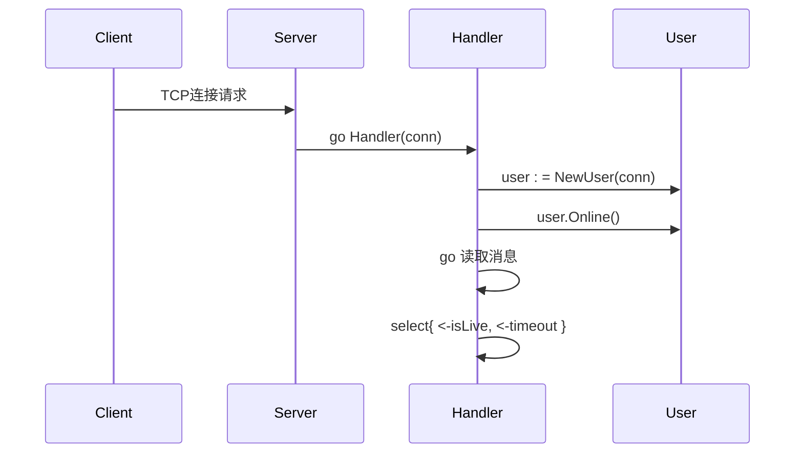
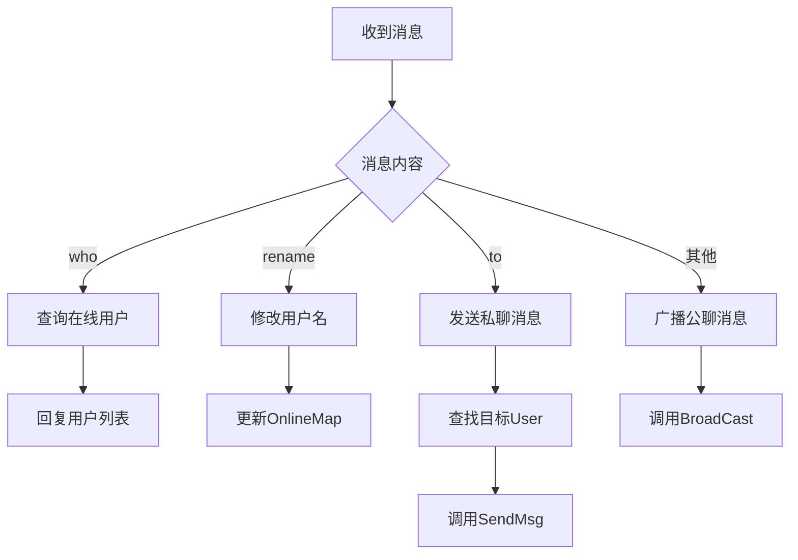

# 项目概述

<cite>
**Referenced Files in This Document**   
- [main.go](file://14-golang-IM-System/ServerV0.8-私聊功能/main.go)
- [server.go](file://14-golang-IM-System/ServerV0.8-私聊功能/server.go)
- [user.go](file://14-golang-IM-System/ServerV0.8-私聊功能/user.go)
- [client.go](file://14-golang-IM-System/client.go)
</cite>

## 目录
1. [项目定位与学习目标](#项目定位与学习目标)
2. [项目架构与核心组件](#项目架构与核心组件)
3. [系统启动与入口流程](#系统启动与入口流程)
4. [服务端核心机制](#服务端核心机制)
5. [用户行为处理逻辑](#用户行为处理逻辑)
6. [关键技术与设计模式](#关键技术与设计模式)
7. [客户端交互与协议](#客户端交互与协议)
8. [常见问题与解决方案](#常见问题与解决方案)

## 项目定位与学习目标

GolangStudy项目是一个专为Go语言学习者设计的渐进式即时通讯系统实践平台。该项目通过一系列版本迭代（从`ServerV0.1`到`ServerV0.8`），系统性地展示了如何从零开始构建一个功能完整的网络服务。其核心定位是作为Go语言的实践教学工具，帮助开发者深入理解网络编程、并发控制和面向对象设计模式在真实项目中的应用。

项目的学习目标是通过动手实践，让开发者掌握Go语言的关键特性：
- **网络编程**：通过TCP协议实现客户端与服务器的长连接通信。
- **并发模型**：利用goroutine和channel构建高并发、非阻塞的I/O处理机制。
- **面向对象设计**：使用结构体（struct）和方法（method）封装服务器、用户等核心业务逻辑。
- **内存与资源管理**：学习如何安全地管理连接、channel和goroutine的生命周期，避免资源泄漏。

**Section sources**
- [main.go](file://14-golang-IM-System/ServerV0.8-私聊功能/main.go#L1-L7)
- [server.go](file://14-golang-IM-System/ServerV0.8-私聊功能/server.go#L1-L144)

## 项目架构与核心组件

该项目采用经典的客户端-服务器（C/S）架构，核心由三个主要组件构成：服务器（Server）、用户（User）和消息广播机制。这些组件协同工作，共同实现了一个支持公聊、私聊、用户管理等功能的即时通讯系统。

```mermaid
graph TB
subgraph "客户端"
C1[客户端1]
C2[客户端2]
CN[客户端N]
end
subgraph "服务器"
S[Server]
U[User]
end
C1 --> S
C2 --> S
CN --> S
S < --> U
```

**Diagram sources**
- [server.go](file://14-golang-IM-System/ServerV0.8-私聊功能/server.go#L8-L18)
- [user.go](file://14-golang-IM-System/ServerV0.8-私聊功能/user.go#L7-L16)

**Section sources**
- [server.go](file://14-golang-IM-System/ServerV0.8-私聊功能/server.go#L8-L18)
- [user.go](file://14-golang-IM-System/ServerV0.8-私聊功能/user.go#L7-L16)

## 系统启动与入口流程

系统的程序入口点位于`main.go`文件中。`main`函数是整个服务的起点，其职责非常明确：创建一个`Server`实例并启动它。通过调用`NewServer("127.0.0.1", 8888)`，系统初始化了一个监听在本地回环地址`127.0.0.1`的8888端口上的服务器对象。随后，`server.Start()`方法被调用，这标志着服务器开始进入其主循环，准备接受来自客户端的连接请求。

这一简洁的入口设计体现了Go语言“大道至简”的哲学，将复杂的网络服务启动过程封装在`Start`方法内部，使得主函数逻辑清晰、易于理解。

**Section sources**
- [main.go](file://14-golang-IM-System/ServerV0.8-私聊功能/main.go#L1-L7)

## 服务端核心机制

服务器（`Server`）是整个系统的核心，负责管理所有客户端连接和消息分发。其核心机制包括服务监听、连接处理和消息广播。

### 服务监听与连接处理

`Start`方法是服务器的启动入口。它首先调用`net.Listen("tcp", "...")`创建一个TCP监听器。一旦监听器就绪，服务器便进入一个无限循环，通过`listener.Accept()`阻塞式地等待新的客户端连接。每当有新连接到来，服务器会立即启动一个新的goroutine来执行`Handler`方法，从而实现并发处理多个客户端的能力，确保了服务的非阻塞特性。

`Handler`方法负责处理单个客户端的整个生命周期。它首先为新连接创建一个`User`对象，并调用`user.Online()`将其注册到在线用户列表中。随后，它启动一个子goroutine来持续读取客户端发来的消息，并将这些消息交给`user.DoMessage()`进行处理。同时，`Handler`的主goroutine通过`select`语句监听一个`isLive` channel和一个5分钟的超时定时器，实现了超时强踢功能。



**Diagram sources**
- [server.go](file://14-golang-IM-System/ServerV0.8-私聊功能/server.go#L120-L142)
- [server.go](file://14-golang-IM-System/ServerV0.8-私聊功能/server.go#L76-L119)

### 消息广播机制

消息广播是实现群聊功能的关键。服务器内部维护一个名为`Message`的channel。`ListenMessager`是一个独立的goroutine，它持续监听这个channel。当任何用户发送消息时，`BroadCast`方法会将格式化后的消息（包含发送者地址和名称）推送到`Message` channel中。`ListenMessager`一旦接收到消息，便会获取读写锁，遍历`OnlineMap`中的所有在线用户，并通过每个用户的私有channel（`User.C`）将消息发送出去，从而实现向所有在线用户广播的效果。

**Section sources**
- [server.go](file://14-golang-IM-System/ServerV0.8-私聊功能/server.go#L34-L45)
- [server.go](file://14-golang-IM-System/ServerV0.8-私聊功能/server.go#L120-L142)

## 用户行为处理逻辑

`User`结构体封装了与单个客户端相关的所有状态和行为。其核心逻辑体现在`Online`、`Offline`和`DoMessage`三个方法中。

### 用户状态管理

`Online`方法在用户连接建立后被调用。它通过获取服务器的写锁，将新创建的`User`对象安全地添加到`Server.OnlineMap`这个并发安全的映射表中，然后调用`BroadCast`通知所有其他用户该用户已上线。`Offline`方法则执行相反的操作：从映射表中删除用户，并广播下线消息。`sync.RWMutex`的使用确保了在高并发环境下对在线用户列表的读写操作是安全的。

### 消息处理与业务逻辑

`DoMessage`方法是用户消息的中央处理器。它根据消息内容的不同前缀执行相应的业务逻辑：
- 当消息为`who`时，查询并返回当前所有在线用户的列表。
- 当消息以`rename|`开头时，尝试修改用户名，并检查新用户名是否已被占用。
- 当消息以`to|`开头时，解析出目标用户名和消息内容，实现私聊功能。
- 对于其他消息，则作为公聊消息进行广播。



**Diagram sources**
- [user.go](file://14-golang-IM-System/ServerV0.8-私聊功能/user.go#L65-L110)

**Section sources**
- [user.go](file://14-golang-IM-System/ServerV0.8-私聊功能/user.go#L29-L133)

## 关键技术与设计模式

### 并发与通信

项目充分利用了Go语言的并发原语。每个客户端连接都由一个独立的goroutine处理，实现了高并发。`channel`被广泛用于组件间的解耦通信：`Server.Message` channel用于广播，`User.C` channel用于向特定客户端发送消息。`sync.RWMutex`则用于保护共享资源`OnlineMap`，允许多个goroutine同时读取（查询在线用户），但写入（用户上下线）时互斥，优化了性能。

### 性能优化建议

- **读写锁的应用**：`RWMutex`在读多写少的场景下（如查询在线用户）性能远优于`Mutex`。
- **超时控制**：通过`time.After`和`select`实现的超时机制，能有效防止因客户端异常断开导致的资源泄漏。
- **资源清理**：在`Offline`和超时处理中，务必关闭`User.C` channel和`conn`连接，避免goroutine泄漏。

**Section sources**
- [server.go](file://14-golang-IM-System/ServerV0.8-私聊功能/server.go#L13-L18)
- [user.go](file://14-golang-IM-System/ServerV0.8-私聊功能/user.go#L11-L16)

## 客户端交互与协议

项目包含一个配套的`client.go`，它展示了客户端如何与服务器交互。客户端通过命令行提供一个简单的交互界面，支持公聊、私聊和修改用户名三种模式。客户端与服务器之间的通信遵循一个简单的文本协议：
- `who`：查询在线用户。
- `rename|新用户名`：修改用户名。
- `to|目标用户名|消息内容`：发送私聊消息。
- 其他任意文本：作为公聊消息广播。

这种基于文本的协议简单易懂，非常适合学习和调试。

**Section sources**
- [client.go](file://14-golang-IM-System/client.go#L1-L203)

## 常见问题与解决方案

### 连接未正确关闭

**问题**：如果客户端异常退出，服务器端的goroutine可能不会被正确回收，导致资源泄漏。
**解决方案**：在`Handler`中，`conn.Read`返回`n == 0`时，应立即调用`user.Offline()`进行清理。项目代码已正确处理此情况。

### 死锁风险

**问题**：在`ListenMessager`和`DoMessage`等方法中，如果锁的获取和释放逻辑不当，可能引发死锁。
**解决方案**：确保锁的获取和释放成对出现，且作用域尽可能小。例如，在`BroadCast`方法中，消息被推送到channel后，锁应立即释放，避免在持有锁的情况下进行耗时的I/O操作。

**Section sources**
- [server.go](file://14-golang-IM-System/ServerV0.8-私聊功能/server.go#L76-L119)
- [user.go](file://14-golang-IM-System/ServerV0.8-私聊功能/user.go#L65-L110)